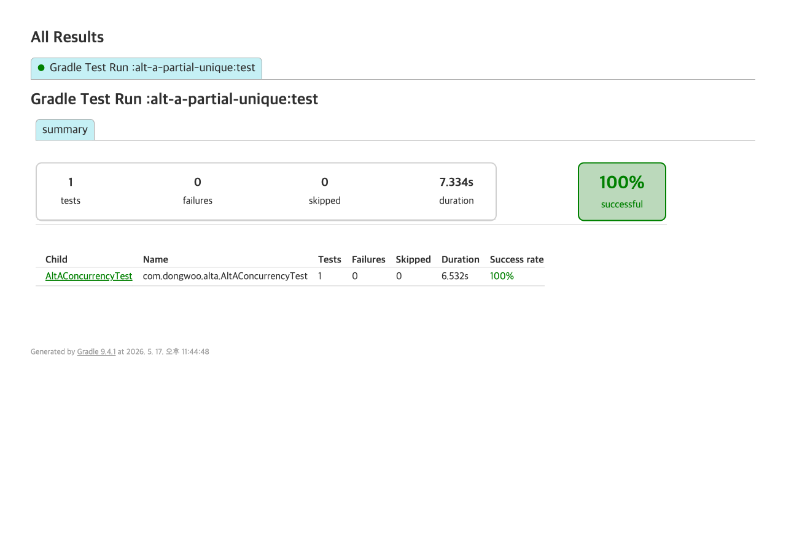

# 대안 A — partial UNIQUE 인덱스 단독

## 동작 방식

- `seat` row를 **잠그지 않고** 그냥 `findById`로 읽는다.
- 상태가 `AVAILABLE`이면 `HELD`로 바꿔 저장하고 `reservation`을 `INSERT`한다.
- `reservation` 테이블에 좌석당 활성(HELD/PAID) 1건만 허용하는 partial UNIQUE 인덱스(`uq_reservation_seat_active`)가 걸려 있어, 동시 INSERT 중 1건만 성공하고 나머지는 PostgreSQL이 `23505 (unique_violation)`로 거부한다.
- 서비스는 `DataIntegrityViolationException`을 catch해 `SeatNotAvailableException`으로 변환한다.

## 장점 (이론)

- 애플리케이션 코드가 단순 (FOR UPDATE 락 로직 없음).
- DB가 race를 **최종 차단**하므로 oversell 불가.
- 락 cascade(트랜잭션 안 외부 호출에 의한 HikariCP 고갈) 위험이 락 자체가 없으므로 발생하지 않음.

## 기각 사유 (이론)

- **모든 동시 요청이 트랜잭션을 열고 DB까지 도달**한다. 9개든 99개든 전부 BEGIN → SELECT → UPDATE → INSERT 시도 → 23505 → ROLLBACK 경로를 탄다.
- `23505` unique violation 로그가 폭주한다. 운영 환경에서 노이즈/알람 오탐 원인.
- HikariCP 커넥션이 동시 100건 모두 점유되었다가 풀리는 패턴. hot 좌석에서 풀 고갈 가능.
- 클라이언트 입장에서 "예약 실패" 시점이 INSERT 단계라 응답 지연 ≒ 전체 트랜잭션 시간. FOR UPDATE 대기가 더 짧을 수도 있음.
- 실패 99건의 비용이 무의미하게 발생한다 — 락이 있었다면 BEGIN 단계에서 대기/실패로 끝났을 일.

## 구현 코드 (핵심)

```java
// ReservationService — 락 없이 findById + status 체크 + save → catch DataIntegrityViolation
@Transactional
public Reservation reserve(Long seatId, String userId) {
    Seat seat = seatRepository.findById(seatId)  // ← FOR UPDATE 없음
            .orElseThrow(...);
    if (seat.getStatus() != SeatStatus.AVAILABLE) {
        throw new SeatNotAvailableException(...);
    }
    seat.hold();
    seatRepository.save(seat);
    try {
        return reservationRepository.save(Reservation.create(seatId, userId, HOLD_DURATION));
    } catch (DataIntegrityViolationException e) {
        // partial UNIQUE index 위반 (PSQL 23505) — 락이 없어 99건이 모두 여기 도달
        throw new SeatNotAvailableException("seat " + seatId + " rejected by partial UNIQUE");
    }
}
```

```sql
-- V1__init.sql: 락 없음, partial UNIQUE만 두고 race를 DB가 차단
CREATE UNIQUE INDEX uq_reservation_seat_active
    ON reservation (seat_id)
    WHERE status IN ('HELD', 'PAID');
```

## 실측 결과

테스트: `AltAConcurrencyTest` — 좌석 100에 100 스레드 동시 reserve.

| 항목 | 값 |
|---|---|
| 성공 (success) | **1** |
| 거부 (rejected 총합) | **99** |
| `DataIntegrityViolation`으로 분류된 거부 | 9 |
| 그 외 거부 (status 체크 단계에서 차단) | 90 |
| 최종 heldCount | **1** |
| 경과 시간 (elapsedMs) | 138 |
| 합격 기준 (heldCount=1) | OK |
| 관찰: PSQL `23505` unique violation 로그 | 다수 (9건이 INSERT까지 도달) |
| 관찰: 모든 트랜잭션이 BEGIN/COMMIT 또는 ROLLBACK 경로를 탐 | 예 |

> 참고: 99건 중 9건만 `DataIntegrityViolation`으로 잡힌 이유 — 첫 번째 트랜잭션이 `seat.status=HELD`로 commit한 뒤 늦게 읽은 스레드들은 `findById`에서 이미 `HELD`로 보이는 row를 가져와 INSERT 전에 status 체크로 거부되었다. 즉 99건 모두 트랜잭션 열고 SELECT까지는 도달했고, 그 중 9건은 INSERT까지 가서 DB unique violation을 받았다.



## 결론

- `heldCount=1` — race 차단은 작동한다. 가설 입증.
- **하지만** 99건이 모두 DB까지 도달했고, 그 중 9건은 INSERT까지 진행해 `23505`를 던졌다. 운영 환경에서 다음 부담이 발생한다:
  - unique violation 로그가 좌석별 100건 단위로 쏟아짐 → 알람 오탐, 로그 비용
  - HikariCP 커넥션이 모든 동시 요청만큼 점유됨 → hot 좌석에서 풀 고갈 가능
  - 실패 99건이 락이 있었다면 발생하지 않았을 비용을 발생시킴
- 결론: **단독 사용 부적합**. partial UNIQUE는 **2차 방어선**으로 베이스라인(`alt-z` — 비관 락 + partial UNIQUE)에 통합하는 것이 적합.
