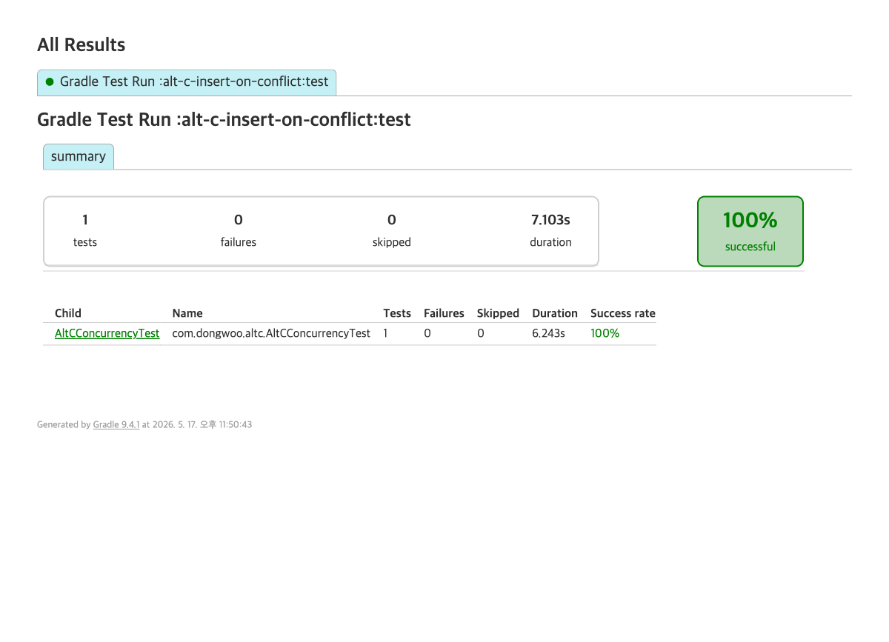

# 대안 C — INSERT ON CONFLICT DO NOTHING

좌석당 활성 reservation 1건 보장. partial UNIQUE index 위에 PostgreSQL `INSERT ... ON CONFLICT DO NOTHING` 단발 SQL 1회로 race를 끝낸다. `@Lock` 없음, JPA dirty-checking 없음, 예외 분기 없음.

## 사용자 행동 예시

좌석 100번 클릭 버튼을 100명이 동시에 누른다. `ReservationRepository.insertHeldIfNoConflict()` 가 native SQL `INSERT ... ON CONFLICT (seat_id) WHERE status IN ('HELD','PAID') DO NOTHING` 을 단발로 보낸다. PostgreSQL 이 INSERT 단계에서 partial UNIQUE index 충돌을 자체 처리하므로 99건은 예외 스택 트레이스 없이 affected=0 만 받는다. 사용자는 1명 "선점됨", 99명 "이미 선점됨" 응답을 elapsed 175ms 안에 받으며 운영 로그도 깨끗하다. 단, 같은 트랜잭션 안에서 방금 INSERT한 reservation 을 `findById` 로 다시 가져오면 EntityManager 1차 캐시 miss 로 DB 왕복 1회가 추가로 발생한다.

## 동작 방식 (native PG 구문)

1. `INSERT INTO reservation (...) VALUES (...) ON CONFLICT (seat_id) WHERE status IN ('HELD','PAID') DO NOTHING`
   - 영향 행 수 1 = INSERT 성공 (race 승자)
   - 영향 행 수 0 = ON CONFLICT 발동 (race 패자) — 예외 없이 `SeatNotAvailableException` 던짐
2. `UPDATE seat SET status='HELD' WHERE id=? AND status='AVAILABLE'`
   - 좌석 상태도 별도 원자적 UPDATE. 영향 행 수 1이 정상.

partial UNIQUE index의 conflict target은 컬럼 + index predicate를 똑같이 명시해야 매칭된다. `ON CONFLICT ON CONSTRAINT <index_name>` 형식은 partial index에서는 작동하지 않는다.

## 장점

- 1 round trip — INSERT 1발에 race 판정까지 끝남
- atomic — 단일 SQL이라 트랜잭션 내부에서 추가 락 불필요
- 락 없음 — `@Lock(PESSIMISTIC_WRITE)` 도 advisory lock도 없음
- 예외 비용 0 — `DataIntegrityViolationException` 스택 트레이스 생성/전파 비용 없음. 영향 행 수로 분기

## 기각 사유

- JPA Repository 추상화 우회 — `save()` / dirty-checking / `@PrePersist` 라이프사이클 미사용. `Reservation` 엔티티는 모델 객체로만 남고 영속화는 native SQL이 담당
- 도메인 응집도 하락 — 좌석 hold 로직이 entity 메서드(`seat.hold()`)가 아니라 SQL 문자열로 분산
- persistence-context 캐시 어긋남 위험 — native INSERT는 EntityManager를 우회하므로 같은 트랜잭션 안에서 방금 INSERT한 row를 `findById`로 가져오려면 추가 쿼리가 필요. flush 타이밍과 1차 캐시 일관성에 신경 써야 함
- 마이그레이션 시 partial UNIQUE index predicate와 SQL의 `ON CONFLICT ... WHERE` 절을 둘 다 동시에 바꿔야 함 — 한쪽만 바뀌면 conflict target inference 실패로 PSQL 42P10

## 구현 코드 (native query 스니펫)

`ReservationRepository.java`:

```java
@Modifying
@Query(value = """
        INSERT INTO reservation
            (seat_id, user_id, status, expires_at, created_at, updated_at)
        VALUES
            (:seatId, :userId, 'HELD', :expiresAt, now(), now())
        ON CONFLICT (seat_id) WHERE status IN ('HELD','PAID')
        DO NOTHING
        """, nativeQuery = true)
int insertHeldIfNoConflict(
        @Param("seatId") Long seatId,
        @Param("userId") String userId,
        @Param("expiresAt") LocalDateTime expiresAt);
```

`SeatRepository.java`:

```java
@Modifying
@Query(value = """
        UPDATE seat
           SET status = 'HELD',
               updated_at = now()
         WHERE id = :seatId
           AND status = 'AVAILABLE'
        """, nativeQuery = true)
int markHeldIfAvailable(@Param("seatId") Long seatId);
```

`ReservationService.java`:

```java
int inserted = reservationRepository.insertHeldIfNoConflict(seatId, userId, expiresAt);
if (inserted == 0) {
    throw new SeatNotAvailableException("seat " + seatId + " lost INSERT ON CONFLICT race");
}
seatRepository.markHeldIfAvailable(seatId);
```

## 실측 결과

좌석 100, 동시 100 thread, PostgreSQL 16 (Testcontainers).

| 항목 | 값 |
|---|---|
| success | 1 |
| raceLoser (ON CONFLICT DO NOTHING 발동) | 99 |
| otherErrors | 0 |
| heldCount (DB) | 1 |
| seat status (DB) | HELD |
| elapsedMs | 175 |

비교: 대안 A(partial UNIQUE 단독, 예외 기반 분기)는 같은 조건에서 비슷한 race 차단 효과를 내지만 99건이 `DataIntegrityViolationException` 스택을 생성·전파한다. 대안 C는 영향 행 수 0을 받아 즉시 분기하므로 예외 비용 자체가 사라진다.

persistence-context 캐시 어긋남 검증: `reservationService.reserve()` 내부에서 INSERT 직후 `reservationRepository.findAll()`로 다시 조회해 본인 row가 보이는지 확인. 100건 중 success=1 케이스에서 `IllegalStateException("inserted reservation not visible after native INSERT")` 미발생 — 같은 트랜잭션 안에서 native INSERT 결과는 후속 select에 정상 노출됨 (단, `findById`는 1차 캐시 miss 후 DB 왕복 1회 필요).



## 결론

race 차단은 작동한다 (heldCount=1, 100건 중 1건만 HELD). 단발 SQL이라 elapsed 175ms로 가장 짧고 예외 비용도 없다. 하지만 그 댓가로 JPA Repository 추상화를 우회하게 되고, 좌석 hold 라이프사이클이 entity 메서드에서 native SQL 문자열로 이동한다. 도메인 응집도 하락이 race 차단 1발의 비용 절감보다 무겁다고 판단해 채택하지 않는다.
