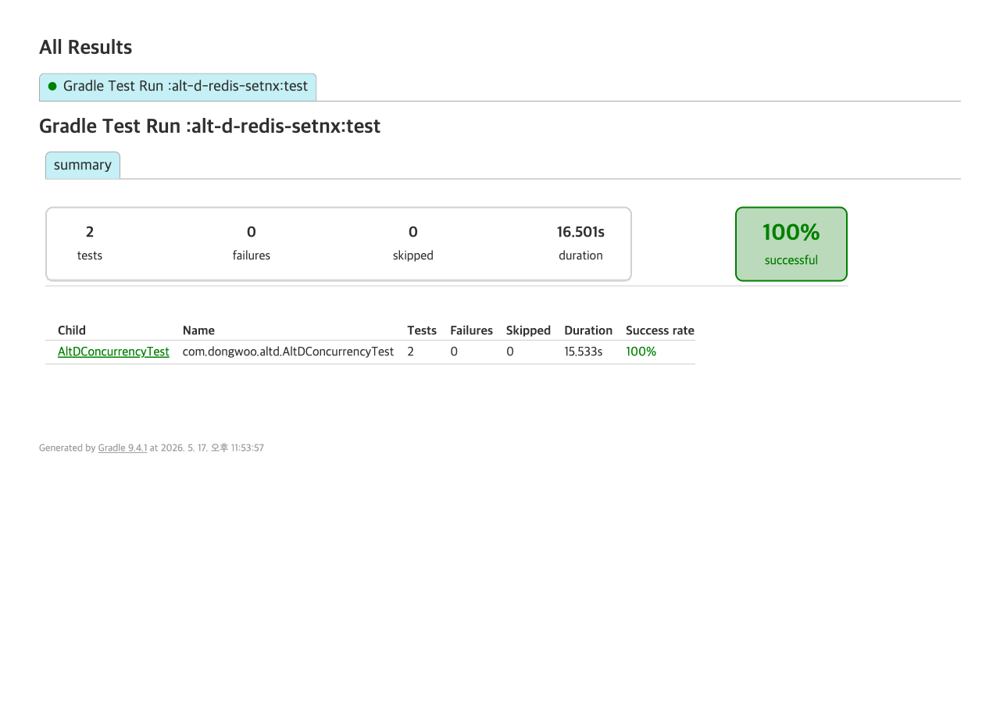

# 대안 D — Redis SETNX 분산 락

DB 외부(Redis)에서 좌석별 분산 락을 잡아 critical section을 직렬화한다.
`@Lock` 도, partial UNIQUE 인덱스도 사용하지 않는다.

## 동작 방식

1. 좌석마다 UUID token 생성.
2. `SET seat:{id} {token} NX EX 5` — 단일 원자 명령으로 락 획득 시도.
   - `NX`: 키가 없을 때만 SET.
   - `EX 5`: 5초 TTL — 호스트 다운 시 좌석이 영원히 잠기는 사고 방지.
3. null 반환 → 다른 스레드가 점유 중 → `SeatNotAvailableException`.
4. OK 반환 → DB 트랜잭션 열고 seat 조회 + AVAILABLE 검증 + HELD 갱신 + reservation insert.
5. `finally` 블록에서 Lua 스크립트로 `GET`+`DEL`을 원자적으로 묶어 해제.
   - token 비교로 TTL 만료 후 다른 소유자가 잡은 락을 잘못 해제하지 않도록 한다.

```lua
if redis.call('get', KEYS[1]) == ARGV[1] then
  return redis.call('del', KEYS[1])
else
  return 0
end
```

## 장점

- 다중 인스턴스에서도 동일 좌석 동시 진입 1건으로 직렬화.
- DB는 평범한 단일 좌석 UPDATE만 수행 — DB 측 락/제약 부담 없음.
- 락 보유 구간이 짧다(트랜잭션 한 건). TTL 5초가 안전 마진.

## 기각 사유

- **단일 노드/단일 인스턴스 단계에서는 over-engineering.** 같은 효과를 `@Lock(PESSIMISTIC_WRITE)` 한 줄, 또는 partial UNIQUE 인덱스 한 줄로 낼 수 있는데 Redis 의존성을 추가해야 한다.
- **Kleppmann fencing token 부재.** GC pause로 인해 락 보유 중인 프로세스가 TTL 안에 작업을 끝내지 못하면, 같은 좌석을 다른 클라이언트가 새 락으로 잡은 상태에서 원 소유자가 DB write를 마저 진행한다 → 이중 HELD. token 비교는 **잘못된 unlock**만 막을 뿐, **만료된 소유자의 늦은 DB write**는 막지 못한다.
- **Redis 단일 인스턴스가 SPOF.** Redlock으로 회피 가능하지만 Martin Kleppmann 비판(2016) 이후 신뢰성 논란이 있다. 강한 일관성을 요구하면 Zookeeper/etcd로 가야 한다 — 그러면 더 무거워진다.
- **운영 부담.** 락 키 누수, TTL 튜닝, Redis 페일오버 중 락 손실 등 신경 쓸 거리가 늘어난다.

## 구현 코드

### `RedisDistributedLock`

```java
public boolean tryLock(String key, String token, int ttlSeconds) {
    Boolean ok = redis.opsForValue().setIfAbsent(key, token, Duration.ofSeconds(ttlSeconds));
    return Boolean.TRUE.equals(ok);
}

public boolean unlock(String key, String token) {
    Long result = redis.execute(UNLOCK_SCRIPT, List.of(key), token);
    return result != null && result == 1L;
}
```

### `ReservationService` 핵심

```java
public Reservation reserve(Long seatId, String userId) {
    String key = "seat:" + seatId;
    String token = UUID.randomUUID().toString();
    if (!lock.tryLock(key, token, 5)) {
        throw new SeatNotAvailableException("seat " + seatId + " — lock busy");
    }
    try {
        return reserveInTx(seatId, userId);
    } finally {
        lock.unlock(key, token);
    }
}
```

## 실측 결과 — 100 스레드 race + zombie lock

| 측정 | 값 |
|---|---|
| success | 1 |
| rejected | 99 |
| heldCount (DB) | 1 |
| lockAcquireFails (SETNX null) | 99 |
| statusRejects (락 잡고도 status=HELD 마주침) | 0 |
| unlockMisses (TTL 만료 후 늦은 unlock) | 0 |
| elapsedMs | 267 |
| Redis 키 잔존 여부 | null (정상 해제) |

**Zombie lock 시나리오** (외부에서 락 잡고 풀지 않음 → TTL 3초):

| 측정 | 값 |
|---|---|
| blockedDuringTTL_ms (TTL 만료 전 차단 시간) | 1 |
| acquiredAfterTTL_ms (만료 후 새 획득 소요) | 29 |
| zombieUnlockSucceeded (만료 후 원 소유자가 unlock 시도) | false |

해석:
- 100건 race 전부 SETNX 단계(`lockAcquireFails=99`)에서 잘렸다 — DB까지 가지 않는다.
- 락 보유 시간이 짧아 `statusRejects=0` (락을 잡은 시점에 seat은 항상 AVAILABLE).
- 모든 reservation이 finally에서 정상 unlock → Redis 키 남지 않음.
- Zombie 시나리오: TTL 만료 직후 새 소유자가 락을 잡고, 원 소유자의 늦은 unlock은 token mismatch로 실패 → **이중 unlock은 막힌다. 그러나 이중 critical section 진입 자체는 fencing token 없이는 못 막는다.**



## 결론

단일 노드 단계에서는 채택하지 않는다. `@Lock(PESSIMISTIC_WRITE)` 또는 partial UNIQUE로 충분하다.
4단계(distributed, 다중 인스턴스)에서 좌석 락이 필요하면 fencing token + 강한 합의(Zookeeper/etcd) 검토. Redis SETNX 단독은 critical section이 짧고 데이터 손실이 허용되는 캐시성 락에 한정.
