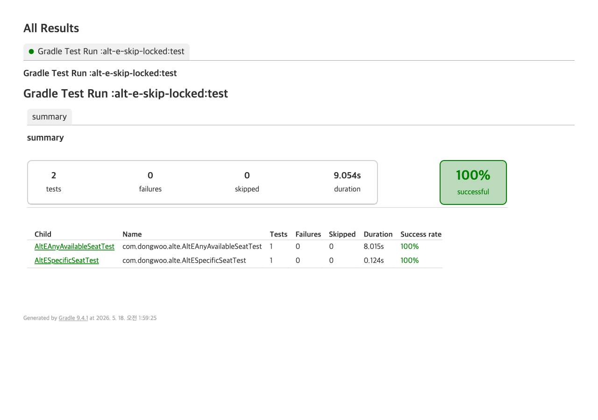

# 대안 E — SELECT FOR UPDATE SKIP LOCKED

## 사용자 행동 예시

**시나리오 1 (본 도메인 — 부적합)**: 좌석 도면에서 사용자가 좌석 100번(맨 앞 정중앙)을 콕 찍어 클릭. 100명이 같은 좌석을 동시에 클릭한다. `seatRepository.findByIdSkipLocked(100L)` 가 `SELECT * FROM seat WHERE id=100 AND status='AVAILABLE' FOR UPDATE SKIP LOCKED` 를 보낸다 — 1건이 락을 잡으면 나머지 99건의 쿼리는 그 행을 건너뛰고 empty Optional 을 받는다. 사용자 1명은 "선점됨", 99명은 "매진" 응답을 받는다. 그러나 좌석은 winner 가 정상 처리 중이고 실제로 매진이 아니다 — 99건 false negative. 사용자 입장에서는 "방금까지 가용이라고 표시됐는데 갑자기 매진?" 으로 당황한다.

**시나리오 2 (작업 큐 — 적합)**: "아무 가용 좌석 1개 달라" 요청 1000건이 좌석 100개에 임의로 분배. 락 잡힌 좌석을 건너뛰고 다른 좌석을 즉시 잡으므로 100 좌석 모두 서로 다른 사용자에게 정확히 1번씩 분배되며 doubleBooked=false, 좌석 소진 후 900건은 정상적인 매진 응답.

## 동작 방식

PostgreSQL의 `SELECT ... FOR UPDATE SKIP LOCKED` 구문 사용.
다른 트랜잭션이 행을 락 잡고 있으면 그 행을 **건너뛰고** 결과에 포함하지 않는다.
일반 `FOR UPDATE`처럼 락 해제를 **기다리지 않는다**.

두 가지 쿼리 패턴:

| 패턴 | 쿼리 | 용도 |
|---|---|---|
| 특정 행 | `WHERE id=:id AND status='AVAILABLE' FOR UPDATE SKIP LOCKED` | 단일 좌석 선점 시도 |
| 임의 행 | `WHERE status='AVAILABLE' FOR UPDATE SKIP LOCKED LIMIT 1` | 작업 큐 디스패치 |

## 장점

- 락 대기 시간 = 0 (대기하지 않고 즉시 다음 행으로)
- 작업 큐(job queue) 디스패치 패턴에 이상적: N개 워커가 서로 다른 작업을 동시에 잡음
- pessimistic lock의 connection-holding 문제 없음 (긴 대기 큐 형성 안 함)

## 시나리오 1 vs 2 — 특정 좌석 요청 vs 임의 가용 좌석 요청

| 시나리오 | 요청 형태 | SKIP LOCKED 결과 | 도메인 적합성 |
|---|---|---|---|
| 1 | "좌석 100을 달라" | 다른 트랜잭션이 락 잡으면 empty → "사용 불가" 응답 | 본 티켓팅 도메인 — **부적합** |
| 2 | "아무 가용 좌석이나 달라" | 락 잡힌 행은 건너뛰고 다른 행 선택 | 작업 큐 디스패치 — **적합** |

## 기각 사유

본 도메인은 사용자가 **특정 좌석**(예: 좌석 100)을 요청한다.
SKIP LOCKED는 이 경우 다음 문제를 일으킨다:

1. 100 스레드가 좌석 100을 동시에 요청
2. 1 스레드가 락 획득 → 다른 99 스레드는 같은 행을 `SELECT ... FOR UPDATE SKIP LOCKED`로 조회
3. 락 잡힌 행이므로 **SKIP** → empty Optional 반환
4. 호출 측은 "AVAILABLE이 아님"과 "락 잡혀 있음"을 SQL 단에서 구분 불가
5. 99 스레드 모두 "좌석 사용 불가" 응답 — 그러나 좌석은 winner가 정상 보유 중

→ **99건 false negative**. 좌석은 정상 처리됐는데도 99명에게 "매진" 응답 전달.

## 구현 코드 (두 가지 native query)

### SeatRepository

```java
// 시나리오 1: 특정 좌석
@Query(value = """
        SELECT *
          FROM seat
         WHERE id = :id
           AND status = 'AVAILABLE'
         FOR UPDATE SKIP LOCKED
        """, nativeQuery = true)
Optional<Seat> findByIdSkipLocked(@Param("id") Long id);

// 시나리오 2: 임의 가용 좌석
@Query(value = """
        SELECT *
          FROM seat
         WHERE status = 'AVAILABLE'
         FOR UPDATE SKIP LOCKED
         LIMIT 1
        """, nativeQuery = true)
Optional<Seat> findAnyAvailableSkipLocked();
```

### ReservationService (요지)

```java
@Transactional(propagation = REQUIRES_NEW)
public Reservation reserveSpecific(Long seatId, String userId) {
    Optional<Seat> opt = seatRepository.findByIdSkipLocked(seatId);
    if (opt.isEmpty()) {
        throw new SeatNotAvailableException("locked or unavailable");  // 구분 불가
    }
    opt.get().hold();
    // ...
}

@Transactional(propagation = REQUIRES_NEW)
public Reservation reserveAny(String userId) {
    Optional<Seat> opt = seatRepository.findAnyAvailableSkipLocked();
    if (opt.isEmpty()) {
        throw new NoSeatAvailableException("all seats locked or sold");
    }
    opt.get().hold();
    // ...
}
```

## 실측 결과

### 시나리오 1 — 특정 좌석에 100 스레드

| 지표 | 값 |
|---|---|
| success | 1 |
| rejected | 99 |
| heldCount (DB) | 1 |
| finalSeatStatus | HELD |
| **falseNegatives** | **99** |

100명 중 1명만 좌석을 받음. 나머지 99명은 "사용 불가" 응답을 받았지만 좌석은 정상 처리됨.

### 시나리오 2 — 100 좌석에 1000 스레드 임의 요청

| 지표 | 값 |
|---|---|
| threadCount | 1000 |
| totalSeats | 100 |
| success | 100 |
| uniqueSeatsAssigned | 100 |
| heldSeatCount (DB) | 100 |
| doubleBooked | false |
| seatNoneAvailable | 900 |

100 좌석 모두 서로 다른 사용자에게 정확히 1번씩 분배. 중복 예약 없음.
좌석 소진 후 도착한 900건은 정상적인 매진 응답(true negative).



## 결론

- 작업 큐 디스패치 시나리오(시나리오 2): 락 대기 없이 N개 워커가 서로 다른 작업 동시 처리 → **적합**
- 본 티켓팅 도메인(시나리오 1): 특정 좌석 요청 시 락 충돌과 매진을 구분 못함 → 99% false negative → **부적합**

같은 SQL 구문이 시나리오에 따라 정반대의 가치를 가진다.
"좌석 1개에 N명 경쟁"이 본 도메인의 패턴이므로 SKIP LOCKED는 채택하지 않는다.
