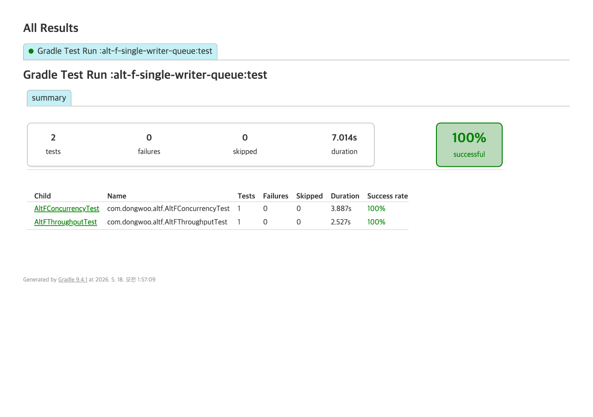

# 대안 F — 단일 작성자 큐 (single-writer queue)

## 동작 방식

- 모든 예매 요청을 메모리 큐 (`LinkedBlockingQueue`) 에 적재
- **worker thread 1개**가 큐에서 순서대로 꺼내 처리
- worker 안에서 좌석 상태 체크 + reservation INSERT — 직렬 실행이므로 race condition 발생 **자체가 불가능**
- 락 / UNIQUE / @Version 어느 것도 사용하지 않음
- 결과는 `CompletableFuture` 로 호출자에게 전달

```java
@Component
public class SingleWriterReservationQueue {
    private final BlockingQueue<ReserveRequest> queue = new LinkedBlockingQueue<>();
    private final ExecutorService worker = Executors.newSingleThreadExecutor();
    // ...
    @PostConstruct
    void start() {
        worker.submit(() -> {
            while (running) {
                ReserveRequest r = queue.take();
                processSerially(r);  // 한 번에 1건만 처리
            }
        });
    }
}
```

## 장점

- race condition 차단 **방법론 자체**가 직렬화 — DB 락도 UNIQUE 제약도 불필요
- DB 부담 최소 — 동시 트랜잭션 1건뿐
- 코드 단순. lock cascade, deadlock, lock timeout 같은 락 관련 사고가 정의상 불가능
- 큐 크기로 backend 보호 — 큐 가득 차면 reject (backpressure 자연 구현)

## 기각 사유

- **throughput hard cap** — worker 1개가 직렬로 처리하므로 처리량은 1 / (트랜잭션 평균 시간) 으로 상한.
- 측정 결과 1000 좌석 × 1000 스레드 (모두 다른 좌석, 충돌 없음) 에서 **492.7 ops/sec**. 비관적 락 + UNIQUE 베이스라인은 같은 조건에서 1385 ops/sec (Distributed 시나리오) — 약 3배 차이.
- p99 latency = 1979ms (1000명의 큐 대기 누적). 사용자 입장 1초+ 응답.
- worker 1개라 horizontal scaling 불가 — 한 좌석 / 한 섹션 단위로 worker 를 늘리는 방법은 있으나 그러면 어차피 sharding + lock 이 들어가야 함.
- Stage 3 (대기열) 와 패턴이 동일하지만 **대기열은 backend 앞단 / 단일 작성자 큐는 backend 내부** 라 위치가 다르다. Stage 3 가 같은 문제를 더 일반적으로 해결.

## 측정 결과

### 시나리오 1 — race 차단 정확성 (좌석 1개 × 100 동시)

```
===== ALT-F RACE RESULT =====
success=1
rejected=99
heldCount=1
queueMaxDepth=99
elapsedMs=180
successLatencyAvgMs=58
successLatencyP99Ms=58
=============================
```

- 100건 동시 진입 시 큐에 99건 누적 (직렬화 입증) 후 1건만 통과. race 차단 OK.

### 시나리오 2 — throughput 한계 (1000 좌석 × 1000 스레드, 모두 다른 좌석)

```
===== ALT-F THROUGHPUT RESULT =====
seats=1000
threads=1000
success=1000
rejected=0
queueMaxDepth=993
elapsedSec=2.030
throughputOpsPerSec=492.7
avgLatencyMs=1070
p99LatencyMs=1979
perItemMs=2.030
===================================
```

- 좌석 충돌이 없는 시나리오에서도 worker 1개가 직렬 처리 → throughput **492.7 ops/sec hard cap**.
- 동시 1000건 동시 진입 시 평균 응답 1초+, p99 ~2초.



## 구현 코드 (핵심)

```java
@Service
@RequiredArgsConstructor
public class ReservationService {
    private final SingleWriterReservationQueue queue;

    public Reservation reserve(Long seatId, String userId) {
        return queue.submit(seatId, userId).join();  // worker 가 처리할 때까지 대기
    }
}
```

```sql
-- V1__init.sql — 의도적으로 보호 장치 없음. race 차단은 worker 직렬화로 입증.
CREATE TABLE seat ( ... );  -- 어떤 락도 UNIQUE 도 없음
```

## 비교

| 지표 | alt-F (단일 작성자) | 베이스라인 (비관적 락 + UNIQUE) |
|---|---|---|
| race 차단 | 직렬 worker | DB 락 + partial UNIQUE |
| 1000 좌석 × 1000 throughput | 493 ops/sec | 1385 ops/sec |
| p99 latency | 1979ms | 1240ms |
| DB 부담 | 동시 tx 1건 | 동시 tx 다수 |
| horizontal scaling | 불가 | 인스턴스 추가로 가능 |
