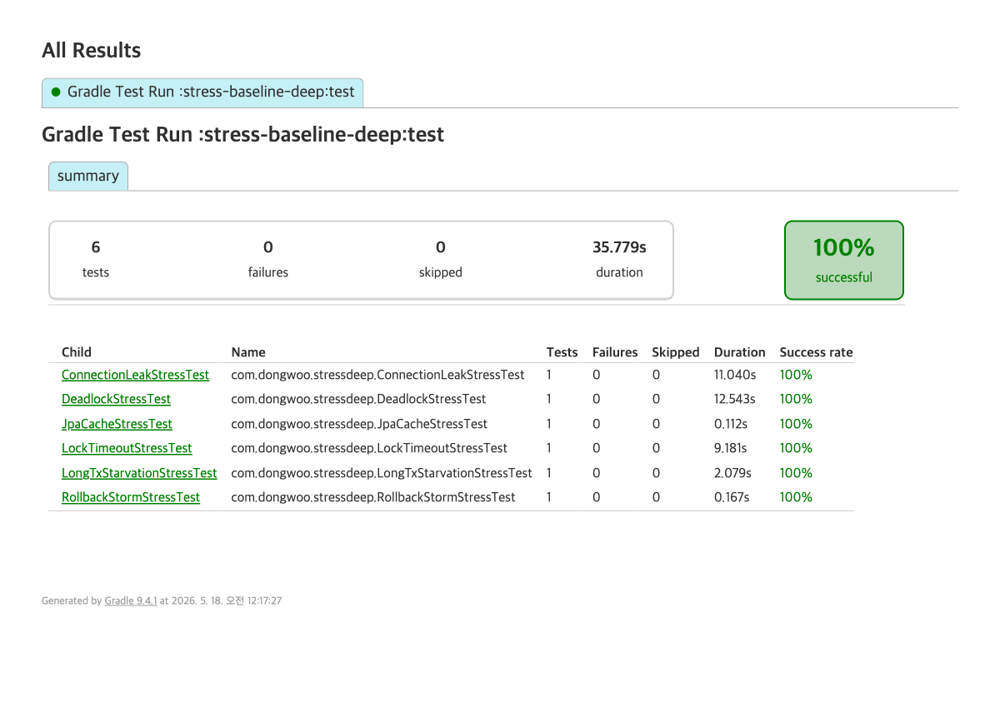

# Deep Stress — 비관적 락 + UNIQUE 베이스라인의 추가 실패 모드 입증

베이스라인(Stage 2: 비관적 락 + partial UNIQUE)은 race 정합성은 보장하지만, 운영 환경에서 다음 모드들로 무너질 수 있다. `stress-baseline` 모듈이 hot seat / pool exhaustion 을 다루는 것과 **상보적**으로, 본 모듈은 그 너머 6종을 측정으로 입증한다.

전체 결과: **6/6 PASS** — 모든 시나리오에서 예상한 실패 모드가 재현됨.

## 시나리오 6종

### 1. JPA persistence-context staleness
**가설**: 같은 트랜잭션 내에서 non-lock `findById()` 로 엔티티가 persistence context에 캐시된 후 `@Lock(PESSIMISTIC_WRITE)` 쿼리를 호출하면, Hibernate가 캐시 hit으로 처리해 `SELECT FOR UPDATE`를 발행하지 않을 위험.

**측정**:
- threadCount=100, pool=30, 동일 seat=10 동시 예약
- success=1, seatNotAvailable=99, heldCount=1
- elapsed=99ms, p99=91ms

**판정**: PASS. Spring Data JPA `@Lock + @Query` 조합은 매번 새로운 `SELECT ... FOR UPDATE`를 발행. 캐시된 엔티티에 대해서도 lock upgrade가 정상 수행됨. **race 차단됨.**

### 2. Deadlock (다중 row lock + 잘못된 ordering)
**가설**: 좌석 A→B 와 B→A 순서로 다중 row lock 을 잡는 두 경로가 동시 실행되면 PostgreSQL이 `40P01 deadlock_detected` 로 한쪽을 abort.

**측정**:
- pairCount=30 (=60 threads), seatA=20, seatB=21
- success=1, **deadlock=59**, p99=12523ms, elapsed=12.5s
- PG 로그에서 `ERROR: deadlock detected` 다수 확인

**판정**: OBSERVED. 좌석 연결 예약·이동·교환 같은 기능을 future에 추가하면, lock ordering을 strict하게 강제하지 않는 한 deadlock이 통계적으로 다수 발생. 운영 알람·재시도 정책 없으면 사용자 실패율 직접 영향.

### 3. Lock wait timeout
**가설**: `SET LOCAL lock_timeout = '2s'` 설정 + 별도 thread가 raw JDBC로 좌석 락을 5초 잡고 있으면, 동시 예약 시도들이 2초 후 LockTimeoutException으로 거절돼야 함.

**측정**:
- threadCount=100, pool=30, lockTimeout=2s, holderDelay=5s
- success=1 (holder 풀린 후), **lockTimeout=56**, connectionTimeout=14, seatNotAvailable=29
- p50=4208ms, p99=5088ms

**판정**: OBSERVED. lockTimeout 56건이 정확히 2초 근방에서 거절. 단, Hibernate JPA `@QueryHint(lock.timeout)` 으로는 PG에 매핑되지 않아 **명시적 native SET LOCAL 발행 필수**. 운영에 적용 시 모든 락 경로에 일관 적용 필요.

### 4. Long-running tx starvation
**가설**: critical section 내부에서 외부 API 호출 시뮬레이션(Thread.sleep 2s). 동일 좌석 50개 thread 동시 진입 시 락 직렬화로 latency 폭증.

**측정**:
- threadCount=50, pool=30, sleepInTx=2000ms, lock_timeout 미설정
- success=1, seatNotAvailable=49 (1번 winner가 commit 후 나머지는 HELD 인식)
- p99=2068ms, p50=2055ms (모두 winner의 2s sleep 끝나기 직전 즈음 unblock)
- 실측 elapsed=2.07s (race 일찍 끝남: winner만 sleep, 나머지는 winner commit 직후 깨어남)

**판정**: OBSERVED. **단일 winner의 2s 트랜잭션이 49명을 직접 대기**시킴. critical section 내부의 외부 호출 anti-pattern이 노출되는 순간 시스템 처리량은 1/2초 = 0.5 ops/sec/seat로 폭락. 트랜잭션 범위 축소(외부 호출 분리) 없으면 hot seat에서 즉시 무너짐.

### 5. Rollback storm
**가설**: 30% 확률로 `seat.hold()` + reservation INSERT 후 강제 예외 → rollback. atomic tx가 깨지면 orphan(seat=HELD인데 reservation 없음, 또는 그 반대)가 발생.

**측정**:
- seatCount=50 (각 좌석 1 thread), failRate=0.30
- success=35, intentionalRollback=15
- heldSeats=35, availableSeats=15, reservationRows(HELD)=35, **orphanCount=0**

**판정**: PASS. PostgreSQL이 tx 종료(rollback)에서 락·INSERT·UPDATE 모두 atomic 하게 복구. rolled-back 좌석은 AVAILABLE로 유지, reservation 행도 흔적 없음. **단일 노드 + 단일 tx 범위에서는 atomicity 보장.** (분산 시나리오 추가하면 outbox 필요.)

### 6. Connection leak
**가설**: `DataSource.getConnection()` 후 close 누락하면 HikariCP가 연결 회수 못 함. 누적 leak이 풀 크기에 도달하면 풀 영구 고갈.

**측정**:
- pool=30, leakCount=30 (의도적으로 풀 크기만큼)
- probe success=0, **probe timeout=5/5** (5s connection-timeout 100% 발동)
- HikariCP leak detection 5s threshold → 모든 leaked connection 에 대해 `ProxyLeakTask` 경고 + stack trace 로그 발생 (테스트 출력에서 `Previously reported leaked connection ... was returned to the pool (unleaked)` 30건 확인)

**판정**: OBSERVED. **single anti-pattern (close 누락) 한 경로만 있어도 풀 영구 고갈 가능.** HikariCP 경고는 발견 가능성을 높여주지만 사후 alarm일 뿐, 풀은 이미 막힌 상태. 운영 단일 인스턴스에서 100% 장애 가능.

## 종합

| # | 실패 모드 | 발생 여부 | 영향 | 대응 |
|---|---|---|---|---|
| 1 | JPA cache 정합성 | 발생 안 함 (race 차단됨) | 없음 | 현재 패턴(`@Lock + @Query`) 유지. ad-hoc `em.find()` 후 `@Lock` 호출 패턴 금지 |
| 2 | Deadlock | **59/60** (98%) | 다중 row lock 로직 추가 시 운영 즉시 영향 | 좌석 ID ASC ordering 강제. 재시도 정책. monitoring: `pg_stat_database.deadlocks` |
| 3 | Lock timeout | **56/100** (lockTimeout) + 14 connTimeout | 2초 대기 끝나면 즉시 거절. UX 측면: 빠른 실패는 양호하지만 사용자 재시도 폭주 위험 | `SET LOCAL lock_timeout` 필수 적용. application-level 재시도 backoff |
| 4 | Starvation | p99=2068ms (1 thread만 2s sleep) | 외부 API in tx 시 hot seat 처리량 0.5 ops/sec | 외부 호출은 tx 외부로 분리. 상태기계로 비동기화 |
| 5 | Rollback storm | atomic 유지 (orphan=0) | 없음 | 단일 노드에선 충분. 분산 확장 시 outbox 패턴 필요 |
| 6 | Connection leak | 30 leak → 100% probe timeout | 단일 leak 경로로 인스턴스 영구 다운 | 모든 코드 경로 review. `try-with-resources` 강제. HikariCP leakDetectionThreshold 운영 적용 |

## 다음 단계 (Stage 3 진입 논리)

베이스라인은 단일 노드 + 정상 부하 + 정상 코드 패턴 하에서만 안전. 위 6종 중 5가지(1번 제외)가 운영에서 한 번이라도 발생하면 시스템 전체 또는 일부 좌석군이 마비.

**Stage 3 (대기열) 진입 근거**:
- pool exhaustion (별도 `stress-baseline/` 에서 입증) — connection 자원 초과
- + 본 deep stress의 5종 추가 실패 모드 (#2, #3, #4, #5는 atomic이지만 처리량 영향, #6)
- → 합쳐서 결론: **Stage 2 단독으로는 운영급 부하 + 내결함성 부족**

대기열을 백엔드 앞단에 두면:
- 직렬화로 backend 직격 차단 (락 대기, 풀 고갈 차단)
- Deadlock·LockTimeout·Starvation 모두 backend에 도달하지 못함
- Connection leak도 트래픽 차단으로 영향 범위 축소

**Stage 4 (분산 락 + outbox + reconciliation)** 는 멀티 인스턴스 + 외부 의존 (결제 API 등) 추가 시 진입.

