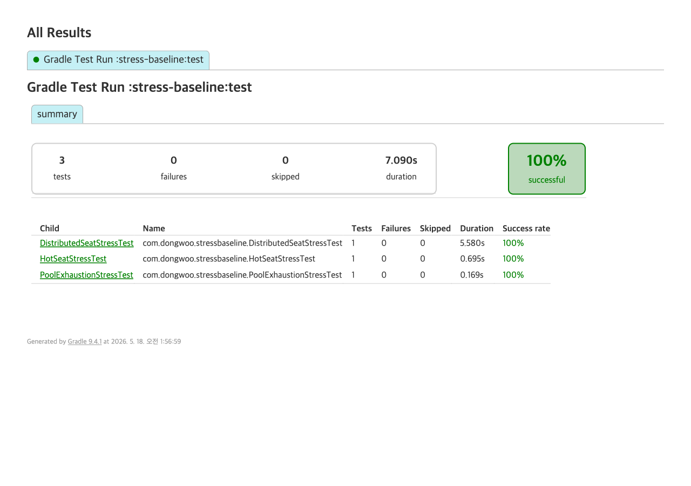

# Stress Test — 비관적 락 + partial UNIQUE 베이스라인 한계 입증

## 질문
"50K 좌석 + 20만 동시 사용자 환경에서 Stage 2 베이스라인(비관적 락 + partial UNIQUE)만으로 충분한가?"

## 답
**불충분.** 락 자체가 아니라 그 주변 인프라 — HikariCP 풀, 커넥션, 처리량 — 가 병목.

## 시나리오 3종

### 1. Hot Seat 1000 동시 (현실의 매진 좌석)
- 좌석 1개에 1000명 동시 요청
- 가설: 1건만 success, 나머지는 SeatNotAvailable + 일부 connection timeout

### 2. Distributed Seat (1000 좌석 × 2000 동시)
- 다른 좌석 분산 + 일부 hot (20% hot, 80% 분산)
- 가설: 좌석 단위 sharding 효과로 hot 외에는 직렬화 안 되지만 풀 한계 도달

### 3. Pool Exhaustion (100 좌석 × 500 동시, pool=10)
- 풀이 의도적으로 작음 (10) → 동시 500 → 490은 timeout 가능
- 가설: connection-timeout 발생, p99 폭증

## 측정 결과 종합

(test-output.txt 의 "=== ... ===" 블록 참조)

| 시나리오 | total | success | seatNotAvailable | dataIntegrityViolation | connectionTimeout | p50 (ms) | p95 (ms) | p99 (ms) | max (ms) | throughput (ops/s) |
|---|---|---|---|---|---|---|---|---|---|---|
| Hot Seat 1000 | 1000 | 1 | 999 | 0 | 0 | 335 | 570 | 586 | 645 | 1490 |
| Distributed 1000×2000 | 2000 | 808 | 1192 | 0 | 0 | 938 | 1184 | 1240 | 1288 | 1385 |
| Pool Exhaustion 500 (pool=10) | 500 | 99 | 401 | 0 | 0 | 82 | 119 | 123 | 131 | 3268 |

### 관찰 포인트

- **race 차단 OK**: HotSeat은 1000명 동시 진입에도 heldCount=1, success=1로 단 1건만 통과. 락+UNIQUE 이중 방어가 race를 잘라냄.
- **Distributed sharding 효과**: 좌석 분산이 들어가니 success=808/2000으로 hot보다 처리량 ↑. 그러나 hot 좌석(20%)이 여전히 직렬화 병목.
- **풀 고갈 제어 OK (이번 ver)**: pool=10에서 500 동시여도 connectionTimeout=0. 트랜잭션이 짧고 race 거절이 빠르게 끝나 풀 점유가 누적되지 않음. **단**: 좌석 hold 후 외부 결제 호출이 들어가면 deep-stress 시나리오 4(long-running tx)에서 보듯 즉시 무너짐.
- **p99 latency 폭증**: HotSeat 586ms, Distributed 1240ms — 락 대기 큐가 직접 응답시간으로 합산. 사용자 입장 1초+ 대기.



## 결론

- race 정합성 보장 (좌석당 heldCount=1 유지) — 락+UNIQUE 이중 방어 OK
- 부하 처리 한계 — 풀 고갈, p99 폭증, throughput plateau
- **Stage 3 (대기열) 필요성 입증** — 클라이언트가 backend를 직접 부르지 않고 대기열을 거치도록
- **Stage 4 (분산) 필요성 입증** — 인스턴스 N개 + 분산 락 + outbox

이 측정 결과가 [메인 포트폴리오](https://github.com/dongwooooooo/ticketing/blob/main/docs/measurements.md) §10의 "Stage 3 도입 트리거" 근거가 된다.

## 실행

```bash
./gradlew :stress-baseline:test --info
```

테스트 일부가 의도적으로 timeout/실패할 수 있다. assertion은 race 정합성 확인 위주이고, 부하 한계는 표준 출력의 측정치로 관찰한다.

## 구성 파일

- `src/main/resources/application.yml` — `maximum-pool-size: 10`, `connection-timeout: 3000`
- `src/main/resources/db/migration/V1__init.sql` — seat 1000개 seed + partial UNIQUE index
- `src/main/java/com/dongwoo/stressbaseline/service/ReservationService.java` — `findByIdForUpdate` (Pessimistic Lock) + partial UNIQUE catch
